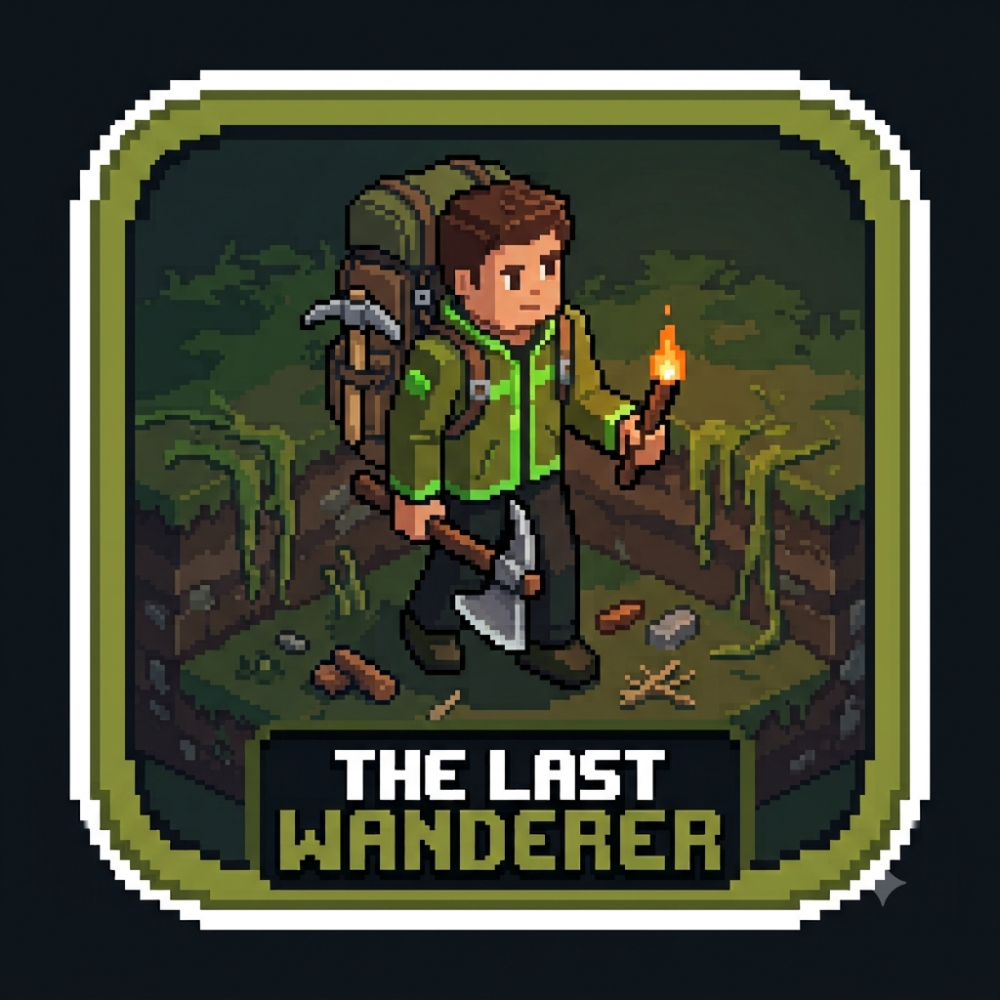

# THE LAST WANDERER

  

  
  
  
  

A 3D voxel-style open-world exploration and survival prototype where humanity has disappeared, and nature has reclaimed the Earth. Built entirely from scratch using pure JavaScript and the HTML5 Canvas API. No WebGL, no Three.js, no game engines.

---

## 📖 The Concept & Narrative

Centuries have passed since the "Great Purge." Humanity pushed the Earth too far with pollution and nuclear waste, and the Earth retaliated with tectonic shifts and disasters, wiping out 90% of life. Now, the concrete has crumbled, and a lush, impenetrable forest has blanketed the remnants of civilization. 

You awaken as a lone descendant, emerging from a subterranean stasis shelter into a vivid, overgrown world. Your goal is to survive, gather the lost materials of the Old World, and learn to live in harmony with nature.

But you are not entirely alone. Deep within the meadow, a mysterious figure bound to the forest stirs. She echoes the form of a human female but possesses an ancient, natural grace. Is she a survivor, or something far older? She watches your steps, waiting for you to prove your worth to the new Earth.

---

## 🎨 Art Direction & Visual Identity

The game avoids the traditional "destroyed apocalypse" aesthetic. Instead, it aims for a peaceful, mysterious, and beautiful atmosphere.

*   **3D Micro-Voxel Art:** The world, characters, and props are constructed from small 3D cubic blocks, rendered with distinct top, front, and side faces for a premium low-poly diorama feel.
*   **Color Palette:** Dominated by lush greens (`#4A5D23`, `#88B04B`), earthy browns, and muted greys for human remnants. **Black is strictly forbidden** in the UI and materials; shadows are achieved using dark greens and browns.
*   **Crisp SVG UI:** All interface elements (buttons, windows, inventory slots) are hardcoded as scalable vector graphics (SVGs) with a 16-bit pixel-art aesthetic, ensuring crisp rendering on any screen size.
*   **Dynamic Lighting:** A global day/ight cycle shifts the ambient light, while local radial lights (Torches, Campfires) dynamically illuminate 3D meshes in real-time.

---

## 🏗️ Technical Architecture

This game does not use any external graphics libraries. The 3D engine was built from scratch using the HTML5 Canvas 2D API.

### 1. The Custom 3D Engine
*   **3D Projection:** The engine uses a fixed isometric camera angle (Yaw and Pitch). 3D coordinates `(x, y, z)` are mathematically projected to 2D screen coordinates `(sx, sy)` using FOV and camera distance calculations.
*   **Painter's Algorithm (Depth Sorting):** All 3D cubes and terrain faces are collected into an array, their average Z-depth is calculated, and they are sorted back-to-front before drawing to the canvas.
*   **Procedural Heightmaps:** Terrain elevation is generated using sine and cosine waves, creating rolling hills. The engine dynamically renders the top face and the "side walls" of tiles to create a true 3D terrain effect.

### 2. Game Systems
*   **A* Pathfinding:** An 8-directional grid-based A* algorithm calculates the shortest walkable path, dynamically avoiding obstacles like trees, rocks, and water.
*   **Minecraft-Style Inventory:** A 36-slot array system (9 hotbar, 27 backpack). Items stack, and the system dynamically checks crafting requirements against the total item count.
*   **Delta-Time Game Loop:** Movement and animations are tied to `requestAnimationFrame` and delta-time (`dt`), ensuring smooth gameplay regardless of frame rate drops.

### 3. PWA & Offline Caching
*   **Service Worker (`sw.js`):** Implements a "Cache-First" strategy. Upon the first load, all HTML, JS, and SVG assets are cached locally. Subsequent loads boot instantly from cache, making the game 100% playable offline. It uses `self.skipWaiting()` to instantly push updates to the user.

---

## 🔄 System Flow

1.  **Initialization:** The browser loads `index.html`, which registers the Service Worker for offline caching.
2.  **Preloading:** `main.js` initiates a `Promise.all` to download all 22 SVG UI assets. A custom isometric loading screen with particles is displayed for a minimum of 5 seconds to set the atmosphere.
3.  **Main Menu:** Once assets are loaded, the main menu renders.
4.  **Game Loop:** Upon clicking "Start", the `update()` and `render()` loops begin via `requestAnimationFrame`.
    *   *Update Phase:* Processes user input (Joystick/WASD), A* pathfinding, entity interactions, gathering timers, particle physics, and day/night light calculations.
    *   *Render Phase:* Clears canvas, projects 3D terrain/entities/player to 2D, sorts by depth, draws 3D scene, draws 2D UI (Hotbar, Menus, Particles) on top.

---

## 🛠️ Tech Stack

*   **Frontend Logic:** Vanilla JavaScript (ES6)
*   **Rendering:** HTML5 Canvas 2D API
*   **UI Assets:** Hardcoded SVG (Scalable Vector Graphics) strings
*   **Offline Support:** Service Worker API, Cache API
*   **Deployment:** Vercel / GitHub Pages

---

## 🎮 How to Play

You can play the game directly in your mobile or desktop browser. For the best experience on mobile, use Chrome and select "Add to Home Screen" to play in full-screen, offline mode.

### Desktop Controls
*   `W A S D` - Move character (Camera-relative direction)
*   `Space` - Jump (Allows climbing small terrain ledges)
*   `Mouse Click` - Move to location / Interact with objects / Place items
*   `C` - Open Crafting Menu
*   `E` - Open Inventory
*   `1 - 9` - Select Hotbar Slots

### Mobile Controls
*   **Left Side (Screen):** Dynamic touch joystick. Touch anywhere on the left half of the screen to spawn the joystick.
*   **Right Side (Screen):** Touch buttons for Break, Jump, Craft, and Inventory.
*   **Tap:** Move to location / Interact / Place items.

### Gameplay Loop
1.  **Explore:** Walk through the meadow, dense forest, and ruined settlements.
2.  **Gather:** Tap trees, rocks, and bushes to gather Wood, Stone, and Fiber. Equip tools (Axe/Pickaxe) from your hotbar to gather faster and yield more resources.
3.  **Craft:** Open the crafting menu to build Axes, Pickaxes, Torches, and Campfires.
4.  **Survive:** Place Campfires and Torches to light up the night. Meet the mysterious Spirit of Nature to begin your story.
